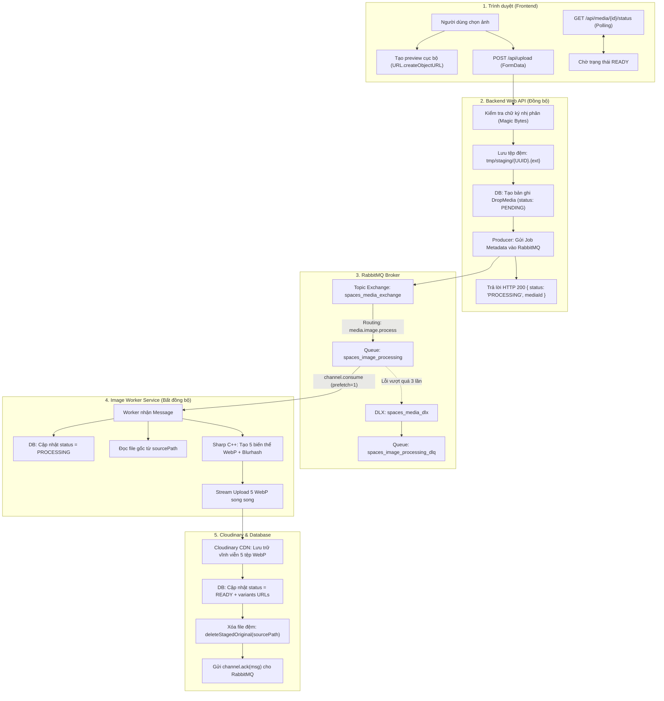
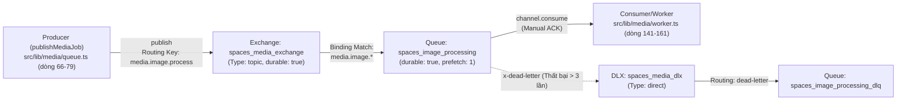

# BÁO CÁO TÌM HIỂU LUỒNG XỬ LÝ ẢNH SỬ DỤNG RABBITMQ TRONG PROJECT

**Người thực hiện:** Thực tập sinh Kỹ thuật  
**Người nhận báo cáo:** Quản lý hướng dẫn thực tập  
**Chủ đề:** Tìm hiểu cơ chế hàng đợi RabbitMQ, luồng xử lý resize ảnh và quản lý cơ sở dữ liệu  
**Dự án:** Spaces — Visual Social Commons  
**Ngày hoàn thành:** 09/10/2026  

---

## 1. Mục đích và phạm vi báo cáo

### 1.1 Mục đích
Báo cáo này được lập nhằm tổng kết quá trình tôi đọc hiểu, phân tích mã nguồn và theo dõi luồng xử lý hình ảnh thực tế trong dự án Spaces. Báo cáo giúp quản lý đánh giá được mức độ hiểu code của tôi về:
1. **Vai trò của RabbitMQ:** Giải quyết bài toán xử lý tác vụ nặng ở chế độ nền (background), giữ cho giao diện web phản hồi tức thì.
2. **Luồng dữ liệu tổng thể:** Cách tệp ảnh đi từ trình duyệt qua tầng Web API, lưu đệm tạm thời, đưa vào hàng đợi, xử lý qua Worker (Sharp C++), đẩy lên Cloudinary và cập nhật trạng thái trong PostgreSQL.
3. **Mối liên hệ giữa các thành phần:** Phân định rõ vai trò của RabbitMQ (điều phối công việc), Sharp (cắt và nén ảnh), Cloudinary (lưu trữ tĩnh & CDN) và Database (lưu siêu dữ liệu & quản lý trạng thái).

### 1.2 Phạm vi
Báo cáo chỉ tập trung vào 3 nội dung có liên quan trực tiếp:
* **RabbitMQ và cơ chế xử lý bất đồng bộ:** Producer, Exchange, Queue, Consumer/Worker, ACK/NACK, Dead Letter Queue.
* **Luồng upload và resize ảnh:** Đệm tạm thời, kiểm tra chữ ký nhị phân, thuật toán bảo toàn tỷ lệ khung hình của Sharp, các biến thể kích thước và upload lên Cloudinary.
* **Database trong luồng xử lý ảnh:** Model `DropMedia`, quan hệ với `Drop`, máy trạng thái vòng đời ảnh và giao dịch nguyên tử (`$transaction`).

*Báo cáo bám sát mã nguồn thực tế trong repository, không đưa vào các lý thuyết hàn lâm trừu tượng, không đưa số liệu benchmark hay đánh giá hiệu năng chưa kiểm chứng.*

### 1.3 Bảng định vị nhanh các file và vị trí dòng code quan trọng
Để người đọc tiện theo dõi và không phải mở đọc toàn bộ tệp mã nguồn dài, bảng dưới đây liệt kê chính xác các đoạn code trọng tâm được phân tích trong báo cáo:

| Thành phần | Đường dẫn tệp tin | Đoạn dòng cần đọc | Nội dung chính |
|---|---|---|---|
| **Giao diện người dùng** | [`src/components/drops/composer/DropComposer.tsx`](file:///D:/Spaces/src/components/drops/composer/DropComposer.tsx#L304-L425) | **Dòng 304 – 425** | Xem trước tức thì (Optimistic Preview), gửi file qua `FormData` và polling trạng thái. |
| **Tiếp nhận Upload (Web API)** | [`src/app/api/upload/route.ts`](file:///D:/Spaces/src/app/api/upload/route.ts#L32-L152) | **Dòng 32 – 152** | Xác thực người dùng, kiểm tra an ninh, lưu đệm tệp, tạo bản ghi DB và đẩy job vào RabbitMQ. |
| **Kiểm tra chữ ký & Đệm tạm** | [`src/lib/media/staging.ts`](file:///D:/Spaces/src/lib/media/staging.ts#L19-L122) | **Dòng 19 – 68** & **Dòng 74 – 122** | Nhận diện Magic Bytes của file nhị phân và ghi/xóa tệp đệm an toàn trong `tmp/staging/`. |
| **Điều phối RabbitMQ (Producer & Topology)** | [`src/lib/media/queue.ts`](file:///D:/Spaces/src/lib/media/queue.ts#L21-L96) | **Dòng 21 – 60** & **Dòng 66 – 96** | Khởi tạo Topology (Exchange, Queue, DLX, DLQ) và hàm gửi message `publishMediaJob`. |
| **Tiến trình ngầm (Consumer / Worker)** | [`src/lib/media/worker.ts`](file:///D:/Spaces/src/lib/media/worker.ts#L23-L162) | **Dòng 23 – 123** & **Dòng 128 – 162** | Lắng nghe hàng đợi (`prefetch(1)`), điều phối resize, upload Cloudinary, update DB, xóa file tạm và xác nhận ACK. |
| **Xử lý cắt nén ảnh (Sharp C++)** | [`src/lib/media/processor.ts`](file:///D:/Spaces/src/lib/media/processor.ts#L25-L140) | **Dòng 25 – 140** | Kiểm tra giới hạn an toàn 40MP, tính tỷ lệ khung hình và sinh đồng thời 5 kích cỡ ảnh WebP bằng `Promise.all`. |
| **Lưu trữ CDN Cloudinary** | [`src/lib/media/cloudinary.ts`](file:///D:/Spaces/src/lib/media/cloudinary.ts#L39-L120) | **Dòng 39 – 120** | Upload song song cả 5 biến thể WebP qua luồng `upload_stream` với định danh publicId chuẩn hóa. |
| **Cấu hình kích thước & Hằng số** | [`src/lib/media/constants.ts`](file:///D:/Spaces/src/lib/media/constants.ts#L7-L102) | **Dòng 19 – 92** & **Dòng 96 – 102** | Bảng kích thước 5 biến thể ảnh WebP và định nghĩa tên Exchange, Queue, Routing Key. |
| **Mô hình CSDL (ORM Prisma)** | [`prisma/schema.prisma`](file:///D:/Spaces/prisma/schema.prisma#L120-L136) | **Dòng 120 – 136** | Cấu trúc bảng `DropMedia` (các cột `status`, `variants`, `width`, `height`, `aspectRatio`, `blurhash`). |
| **Xuất bản bài viết (Transaction)** | [`src/actions/drops.ts`](file:///D:/Spaces/src/actions/drops.ts#L120-L198) | **Dòng 120 – 198** | Giao dịch nguyên tử `prisma.$transaction` ràng buộc `Drop` và `DropMedia`. |

---

## 2. Sơ đồ luồng tổng thể

Sơ đồ dưới đây mô tả luồng di chuyển của dữ liệu từ khi người dùng bấm tải ảnh đến khi ảnh sẵn sàng phục vụ:



---

## Phần 1: RabbitMQ được sử dụng để làm gì?

### 1.1 Vấn đề thực tế cần giải quyết
Trong dự án Spaces, ảnh người dùng tải lên thường có dung lượng lớn (lên tới 15MB, độ phân giải cao). Mỗi bức ảnh cần được cắt thành nhiều kích cỡ khác nhau để phục vụ cho các vị trí hiển thị: ảnh nhỏ cho ô tìm kiếm, ảnh vừa cho lưới bài viết, ảnh lớn cho trang chi tiết và ảnh siêu nét cho chế độ xem toàn màn hình. Đồng thời, ảnh cần được chuyển đổi sang định dạng WebP để tối ưu dung lượng tải trang.

Nếu backend thực hiện việc giải mã và nén ảnh trực tiếp ngay trong hàm xử lý HTTP Request của Next.js, mỗi lượt upload sẽ bắt người dùng phải chờ từ vài giây. Nếu nhiều người cùng đăng ảnh, CPU máy chủ sẽ bị quá tải, gây nghẽn toàn bộ ứng dụng web.

### 1.2 Vai trò của RabbitMQ
RabbitMQ đóng vai trò làm **hàng đợi điều phối công việc trung gian**:
* **Phân tách công việc:** Tách quy trình upload thành hai phần: phần tiếp nhận nhanh (đồng bộ) và phần xử lý nặng (bất đồng bộ chạy ngầm).
* **Giải phóng người dùng ngay lập tức:** Khi người dùng upload ảnh, backend chỉ kiểm tra an ninh cơ bản, lưu tạm file vào ổ cứng và gửi một tin nhắn ngắn vào RabbitMQ rồi trả về kết quả thành công ngay lập tức. Người dùng không cần phải chờ đợi quá trình nén ảnh.
* **Điều tiết tải ổn định (Throttling):** Worker sẽ lấy từng bức ảnh ra xử lý tuần tự theo khả năng của phần cứng, tránh làm sập máy chủ khi lượng người dùng đăng ảnh tăng đột biến.

### 1.3 Phân định các thành phần trong mã nguồn
1. **Thành phần tiếp nhận upload (Web API):** Nằm tại [`src/app/api/upload/route.ts (từ dòng 32 đến dòng 152)`](file:///D:/Spaces/src/app/api/upload/route.ts#L32-L152) (hàm `POST`). Nhận request, kiểm tra CSRF, xác thực người dùng, kiểm tra chữ ký nhị phân file, lưu file vào thư mục đệm và gọi Producer.
2. **Thành phần gửi tin nhắn (Producer):** Nằm tại [`src/lib/media/queue.ts (từ dòng 66 đến dòng 96)`](file:///D:/Spaces/src/lib/media/queue.ts#L66-L96) (hàm `publishMediaJob`). Chịu trách nhiệm kết nối với RabbitMQ và đẩy thông điệp công việc vào exchange.
3. **Thành phần xử lý ảnh (Consumer/Worker):** Nằm tại [`src/lib/media/worker.ts (từ dòng 128 đến dòng 162 và từ dòng 23 đến dòng 123)`](file:///D:/Spaces/src/lib/media/worker.ts#L128-L162) (hàm `startImageWorker` và `executeImageProcessingJob`). Lắng nghe tin nhắn từ queue, gọi thư viện Sharp để cắt ảnh, đẩy lên Cloudinary và cập nhật cơ sở dữ liệu.

---

## Phần 2: Luồng hoạt động tổng thể (11 bước chi tiết)

Dưới đây là hành trình chi tiết của một bức ảnh qua 11 bước trong mã nguồn, có chỉ rõ chính xác các khoảng dòng code xử lý:

### Bước 1: Người dùng chọn và gửi ảnh (Client)
- **Thành phần thực hiện:** File [`src/components/drops/composer/DropComposer.tsx (từ dòng 304 đến dòng 425)`](file:///D:/Spaces/src/components/drops/composer/DropComposer.tsx#L304-L425).
- **Dữ liệu đầu vào:** Tệp tin ảnh người dùng chọn từ máy tính/điện thoại.
- **Công việc thực hiện:**
  - *Dòng 324 – 350:* Trình duyệt tạo ngay URL tạm thời bằng `URL.createObjectURL(file)` để đưa ảnh lên giao diện ngay lập tức (0ms UI wait), giúp người dùng không cảm thấy ứng dụng bị khựng.
  - *Dòng 357 – 367:* Đóng gói file vào đối tượng `FormData` và gửi request `fetch('/api/upload', { method: 'POST', body: formData })`.
  - *Dòng 393 – 425:* Nếu server phản hồi `status: 'PROCESSING'`, client bắt đầu cơ chế Polling định kỳ gọi `/api/media/${mediaId}/status` để cập nhật trạng thái.
- **Bước tiếp theo:** Chuyển tệp tin nhị phân qua mạng tới backend Web API.

### Bước 2: Backend nhận file và kiểm tra an ninh (Web API)
- **Thành phần thực hiện:** File [`src/app/api/upload/route.ts (từ dòng 33 đến dòng 97)`](file:///D:/Spaces/src/app/api/upload/route.ts#L33-L97).
- **Dữ liệu đầu vào:** `req: NextRequest` chứa `FormData`.
- **Công việc thực hiện:**
  - *Dòng 33 – 44:* Kiểm tra nguồn gốc request chống tấn công CSRF (`validateRequestOrigin`).
  - *Dòng 46 – 53:* Xác thực phiên đăng nhập của người dùng (`getCurrentUser`), từ chối nếu chưa đăng nhập.
  - *Dòng 55 – 72:* Giới hạn tần suất gọi API (`checkRateLimit`: tối đa 10 lượt upload/phút cho mỗi người dùng).
  - *Dòng 83 – 91:* Kiểm tra MIME type theo header gửi lên (`ALLOWED_MIME_TYPES`: JPEG, PNG, WebP, GIF).
  - *Dòng 93 – 97:* Kiểm tra kích thước tệp tin không vượt quá 15MB (`MAX_UPLOAD_FILE_SIZE`).
- **Bước tiếp theo:** Đưa buffer nhị phân vào bước kiểm tra chữ ký file và lưu đệm.

### Bước 3: Kiểm tra chữ ký nhị phân và lưu file đệm tạm thời (Staging)
- **Thành phần thực hiện:** File [`src/lib/media/staging.ts (từ dòng 19 đến dòng 68 và từ dòng 74 đến dòng 102)`](file:///D:/Spaces/src/lib/media/staging.ts#L19-L68) (được gọi tại [`src/app/api/upload/route.ts:101-111`](file:///D:/Spaces/src/app/api/upload/route.ts#L101-L111)).
- **Dữ liệu đầu vào:** Bộ đệm nhị phân `buffer: Buffer`.
- **Công việc thực hiện:**
  - *Dòng 19 – 68 (`detectImageSignature`):* Đọc trực tiếp các byte đầu tiên của file để nhận diện đúng định dạng ảnh thực tế (Magic Bytes: JPEG `FF D8 FF`, PNG `89 50 4E 47`, GIF `47 49 46`, WebP `RIFF...WEBP`), ngăn chặn kẻ xấu đổi tên file mã độc thành `.jpg`.
  - *Dòng 74 – 102 (`stageOriginalUpload`):* Tạo tên tệp ngẫu nhiên bằng UUID và lưu vào thư mục `tmp/staging/{randomUUID()}.{ext}`. Có kiểm tra đường dẫn an toàn để chống tấn công Path Traversal.
- **Kết quả:** Trả về đối tượng `{ sourcePath, sizeBytes, mime }`.
- **Bước tiếp theo:** Tạo bản ghi theo dõi trong cơ sở dữ liệu.

### Bước 4: Tạo bản ghi cơ sở dữ liệu ban đầu
- **Thành phần thực hiện:** File [`src/app/api/upload/route.ts (từ dòng 114 đến dòng 122)`](file:///D:/Spaces/src/app/api/upload/route.ts#L114-L122).
- **Dữ liệu đầu vào:** `mediaId` (chuỗi UUID mới sinh) và `dropId` (nếu có).
- **Công việc thực hiện:** Gọi `prisma.dropMedia.create` để tạo bản ghi trong bảng `DropMedia` với trạng thái ban đầu là `status: 'PENDING'` và đường dẫn `url: ''`.
- **Bước tiếp theo:** Đóng gói Job Metadata và đưa vào hàng đợi.

### Bước 5: Producer gửi message vào RabbitMQ và phản hồi HTTP
- **Thành phần thực hiện:** File [`src/lib/media/queue.ts (từ dòng 66 đến dòng 79)`](file:///D:/Spaces/src/lib/media/queue.ts#L66-L79) và [`src/app/api/upload/route.ts (từ dòng 124 đến dòng 146)`](file:///D:/Spaces/src/app/api/upload/route.ts#L124-L146).
- **Dữ liệu đầu vào:** Đối tượng `job: MediaJobPayload`.
- **Công việc thực hiện:**
  - *Dòng 124 – 134 (`route.ts`):* Đóng gói thông tin job gồm `jobId`, `mediaId`, `sourcePath`, `mimeType`, `retryCount: 0`.
  - *Dòng 66 – 79 (`queue.ts`):* Chuyển payload thành JSON Buffer và đẩy vào RabbitMQ với cờ bền vững `persistent: true`.
  - *Dòng 140 – 146 (`route.ts`):* API trả về ngay cho client mã `HTTP 200` kèm JSON `{ success: true, status: 'PROCESSING', mediaId }`.
- **Kết quả:** Kết nối HTTP giữa client và server kết thúc tại đây (chỉ mất ~20–50ms).
- **Bước tiếp theo:** RabbitMQ định tuyến message đến queue ngầm.

### Bước 6: RabbitMQ định tuyến message đến hàng đợi
- **Thành phần thực hiện:** RabbitMQ Broker (Topology được thiết lập tại [`src/lib/media/queue.ts:36-45`](file:///D:/Spaces/src/lib/media/queue.ts#L36-L45)).
- **Dữ liệu đầu vào:** Message gửi tới Exchange `spaces_media_exchange` với routing key `media.image.process`.
- **Công việc thực hiện:** Dựa vào cấu hình binding khớp với mẫu `media.image.*`, Exchange chuyển message vào hàng đợi bền vững `spaces_image_processing`.
- **Bước tiếp theo:** Consumer lấy message ra xử lý.

### Bước 7: Consumer/Worker tiếp nhận message
- **Thành phần thực hiện:** File [`src/lib/media/worker.ts (từ dòng 141 đến dòng 161)`](file:///D:/Spaces/src/lib/media/worker.ts#L141-L161) và [`src/lib/media/worker.ts (từ dòng 27 đến dòng 48)`](file:///D:/Spaces/src/lib/media/worker.ts#L27-L48).
- **Dữ liệu đầu vào:** `msg: ConsumeMessage` từ hàng đợi `spaces_image_processing`.
- **Công việc thực hiện:**
  - *Dòng 141 – 142:* Worker giữ nguyên tắc `channel.prefetch(1)` — chỉ nhận 1 việc tại 1 thời điểm.
  - *Dòng 27 – 36:* Kiểm tra tính trùng lặp (Idempotent): nếu bản ghi DB đã ở trạng thái `READY` thì bỏ qua.
  - *Dòng 38 – 48:* Cập nhật trạng thái trong database sang `status: 'PROCESSING'`.
- **Bước tiếp theo:** Đọc tệp gốc từ đĩa cứng.

### Bước 8: Đọc file tạm và resize ảnh thành nhiều phiên bản
- **Thành phần thực hiện:** File [`src/lib/media/worker.ts (dòng 51 – 52)`](file:///D:/Spaces/src/lib/media/worker.ts#L51-L52) và [`src/lib/media/processor.ts (từ dòng 25 đến dòng 140)`](file:///D:/Spaces/src/lib/media/processor.ts#L25-L140).
- **Dữ liệu đầu vào:** Đường dẫn tệp đệm `sourcePath`.
- **Công việc thực hiện:**
  - *Dòng 51 (`worker.ts`):* Gọi `fs.readFile(job.sourcePath)` nạp buffer vào bộ nhớ.
  - *Dòng 33 – 47 (`processor.ts`):* Khởi tạo Sharp với giới hạn an toàn chống tràn RAM (`limitInputPixels: 40_000_000`, tối đa 10.000px).
  - *Dòng 38 – 53 (`processor.ts`):* Chuẩn hóa góc xoay theo EXIF (`.rotate()`) và tính tỷ lệ khung hình `aspectRatio`.
  - *Dòng 57 – 140 (`processor.ts`):* Sử dụng `Promise.all` để sinh đồng thời **5 biến thể WebP** (`detail`, `large`, `medium`, `small`, `thumb`) cùng 1 ảnh mờ placeholder (`blurhash`).
- **Kết quả:** Trả về đối tượng `variants` chứa 5 bộ đệm ảnh WebP nằm trong bộ nhớ RAM.
- **Bước tiếp theo:** Đẩy các bộ đệm ảnh lên Cloudinary.

### Bước 9: Upload các biến thể ảnh lên Cloudinary
- **Thành phần thực hiện:** File [`src/lib/media/cloudinary.ts (từ dòng 104 đến dòng 120)`](file:///D:/Spaces/src/lib/media/cloudinary.ts#L104-L120) (hàm `uploadAllVariants`).
- **Dữ liệu đầu vào:** 5 bộ đệm WebP và mã `mediaId`.
- **Công việc thực hiện:**
  - *Dòng 104 – 120:* Sử dụng `Promise.all` để đẩy cả 5 tệp lên Cloudinary đồng thời qua luồng nhị phân Stream (`uploadVariantToCloudinary` tại dòng 39 – 99).
  - *Dòng 44 – 77:* Đặt tên publicId xác định theo mẫu `spaces/drops/${dropId}/${mediaId}/${variantKey}` kèm tùy chọn `overwrite: true`.
- **Kết quả:** Nhận về danh sách các đường dẫn HTTPS an toàn (`secureUrl`) từ Cloudinary.
- **Bước tiếp theo:** Lưu các đường dẫn này vào cơ sở dữ liệu.

### Bước 10: Cập nhật Database sang trạng thái hoàn tất (READY)
- **Thành phần thực hiện:** File [`src/lib/media/worker.ts (từ dòng 72 đến dòng 86)`](file:///D:/Spaces/src/lib/media/worker.ts#L72-L86).
- **Dữ liệu đầu vào:** Các đường dẫn Cloudinary và thông số hình học của ảnh.
- **Công việc thực hiện:** Gọi `prisma.dropMedia.update`:
  - Cập nhật trạng thái `status: 'READY'`.
  - Lưu link ảnh lớn (`large`) vào cột `url`.
  - Lưu toàn bộ danh sách 5 link ảnh WebP vào cột `variants` (dưới dạng chuỗi JSON).
  - Ghi nhận `width`, `height`, `aspectRatio`, `blurhash`.
- **Bước tiếp theo:** Dọn dẹp tệp tin đệm tạm thời.

### Bước 11: Xóa file tạm và xác nhận hoàn tất message (ACK)
- **Thành phần thực hiện:** File [`src/lib/media/worker.ts (từ dòng 90 đến dòng 96 và dòng 156)`](file:///D:/Spaces/src/lib/media/worker.ts#L90-L96).
- **Dữ liệu đầu vào:** Đường dẫn `sourcePath` và tin nhắn `msg`.
- **Công việc thực hiện:**
  - *Dòng 90 – 96:* Gọi hàm `deleteStagedOriginal(sourcePath)` (triển khai tại [`staging.ts:104-122`](file:///D:/Spaces/src/lib/media/staging.ts#L104-L122)) để xóa tệp tin trong thư mục `tmp/staging/` nhằm giải phóng ổ cứng.
  - *Dòng 156:* Gọi lệnh `channel.ack(msg)` báo cho RabbitMQ xóa vĩnh viễn message khỏi hàng đợi.
- **Kết quả:** Chu trình xử lý một bức ảnh kết thúc thành công trọn vẹn.

---

## Phần 3: Producer gửi message như thế nào?

### 3.1 Trích đoạn code thực tế của Producer
Đoạn code gửi message được định nghĩa tại hàm `publishMediaJob` trong file [`src/lib/media/queue.ts (từ dòng 66 đến dòng 79)`](file:///D:/Spaces/src/lib/media/queue.ts#L66-L79):

```ts
// File: src/lib/media/queue.ts, Dòng 66 - 79
export async function publishMediaJob(job: MediaJobPayload): Promise<boolean> {
  const ch = await getRabbitChannel();

  if (ch && isRabbitAvailable) {
    const payloadBuffer = Buffer.from(JSON.stringify(job));
    return ch.publish(RABBITMQ_EXCHANGE_NAME, RABBITMQ_ROUTING_KEY, payloadBuffer, {
      persistent: true,
      contentType: 'application/json',
      messageId: job.jobId,
      headers: {
        'x-retry-count': job.retryCount,
      },
    });
  }

  // Dòng 81 - 95: Fallback sang in-memory queue nếu RabbitMQ broker chưa khởi chạy...
}
```

### 3.2 Giải thích hoạt động của đoạn code
- **Vị trí trong luồng:** Hàm này được gọi tại dòng 137 của [`src/app/api/upload/route.ts`](file:///D:/Spaces/src/app/api/upload/route.ts#L137), ngay sau khi file đã được ghi an toàn vào đĩa tạm `tmp/staging/` (dòng 101 – 111) và bản ghi database ban đầu đã tạo xong (dòng 114 – 122).
- **Đầu vào của hàm:** Một đối tượng `job` chứa thông tin công việc theo interface `MediaJobPayload` ([`src/lib/media/types.ts:3-12`](file:///D:/Spaces/src/lib/media/types.ts#L3-L12)).
- **Xử lý:** Lấy channel kết nối RabbitMQ qua hàm `getRabbitChannel()`. Chuyển đối tượng `job` thành chuỗi JSON và bọc lại trong `Buffer.from(...)`. Gọi phương thức `ch.publish(...)` để đẩy dữ liệu vào Exchange với cấu hình `persistent: true` (lưu trữ trên đĩa để không mất tin khi restart broker).
- **Đầu ra:** Trả về `true` nếu message đã được chuyển giao thành công cho broker.
- **Phản hồi người dùng:** Ngay tại dòng 140 – 146 của `route.ts`, server gửi trả lời HTTP 200 cho người dùng mà không cần chờ worker xử lý xong.

### 3.3 Các trường dữ liệu trong message payload
Message mang cấu trúc JSON thực tế theo định nghĩa tại [`src/lib/media/types.ts (từ dòng 3 đến dòng 12)`](file:///D:/Spaces/src/lib/media/types.ts#L3-L12):

| Tên trường dữ liệu | Kiểu dữ liệu | Ý nghĩa nghiệp vụ | Vị trí tạo ra | Vị trí sử dụng |
|---|---|---|---|---|
| `jobId` | `string` | Mã UUID ngẫu nhiên định danh cho phiên xử lý (dùng để ghi log kiểm toán). | `route.ts:125` | `worker.ts:24` |
| `mediaId` | `string` | Khóa chính của bản ghi trong bảng `DropMedia` (dùng để update DB). | `route.ts:126` | `worker.ts:27, 73` |
| `dropId` | `string?` | Mã bài viết liên kết (nếu người dùng đăng ảnh trong một Drop cụ thể). | `route.ts:127` | `worker.ts:55` (để phân nhóm thư mục trên Cloudinary) |
| `sourcePath` | `string` | **Đường dẫn tuyệt đối đến tệp đệm tạm thời trên đĩa cứng**. | `staging.ts:98` | `worker.ts:51` (dùng để đọc file nhị phân) |
| `originalFilename` | `string` | Tên tệp định danh dạng `upload-{mediaId}`. | `route.ts:129` | `worker.ts:100` |
| `mimeType` | `string` | Kiểu MIME thực tế của ảnh (`image/jpeg`, `image/png`,...). | `staging.ts:99` | `worker.ts:52` |
| `retryCount` | `number` | Số lần tác vụ đã bị thử lại (bắt đầu từ 0). | `route.ts:131` | `worker.ts:98` (kiểm tra giới hạn thử lại) |
| `createdAt` | `string` | Dấu thời gian tạo job theo định dạng ISO chuẩn. | `route.ts:132` | `worker.ts:25` |

> **Điểm mấu chốt trong thiết kế:** Message **chỉ mang đường dẫn `sourcePath` chứ không mang dữ liệu nhị phân của ảnh**. Tệp ảnh nằm yên trên ổ đĩa máy chủ. Nhờ vậy message rất nhẹ ($\approx 350\text{ bytes}$), gửi vào hàng đợi chỉ mất 1–2 mili-giây, không tiêu tốn bộ nhớ RAM của RabbitMQ Broker.

---

## Phần 4: RabbitMQ tiếp nhận và chuyển message ra sao?

### 4.1 Cấu hình Topology RabbitMQ trong mã nguồn
Mạng lưới (Topology) của RabbitMQ được khai báo tập trung tại hàm `getRabbitChannel` trong file [`src/lib/media/queue.ts (từ dòng 21 đến dòng 60)`](file:///D:/Spaces/src/lib/media/queue.ts#L21-L60):

```ts
// File: src/lib/media/queue.ts, Dòng 30 - 45
// 1. Cấu hình Dead Letter Exchange & Queue để hứng tin nhắn hỏng (Dòng 30 - 34)
await channel.assertExchange(RABBITMQ_DLX_EXCHANGE, 'direct', { durable: true });
await channel.assertQueue(RABBITMQ_DLQ_NAME, { durable: true });
await channel.bindQueue(RABBITMQ_DLQ_NAME, RABBITMQ_DLX_EXCHANGE, 'dead-letter');

// 2. Cấu hình Topic Exchange chính và Queue xử lý ảnh có liên kết Dead Letter (Dòng 36 - 45)
await channel.assertExchange(RABBITMQ_EXCHANGE_NAME, 'topic', { durable: true });
await channel.assertQueue(RABBITMQ_QUEUE_NAME, {
  durable: true,
  arguments: {
    'x-dead-letter-exchange': RABBITMQ_DLX_EXCHANGE,
    'x-dead-letter-routing-key': 'dead-letter',
  },
});
await channel.bindQueue(RABBITMQ_QUEUE_NAME, RABBITMQ_EXCHANGE_NAME, 'media.image.*');
```

### 4.2 Các thông số định tuyến thực tế
Theo các hằng số định nghĩa trong [`src/lib/media/constants.ts (từ dòng 96 đến dòng 102)`](file:///D:/Spaces/src/lib/media/constants.ts#L96-L102):
- **Tên Exchange chính (`RABBITMQ_EXCHANGE_NAME`):** `spaces_media_exchange` (loại `topic`, thuộc tính `durable: true`).
- **Tên Queue chính (`RABBITMQ_QUEUE_NAME`):** `spaces_image_processing` (thuộc tính `durable: true`).
- **Routing Key phát hành (`RABBITMQ_ROUTING_KEY`):** `media.image.process`.
- **Mẫu liên kết (Binding Pattern):** `media.image.*`.
- **Dead Letter Exchange (`RABBITMQ_DLX_EXCHANGE`):** `spaces_media_dlx` (loại `direct`).
- **Dead Letter Queue (`RABBITMQ_DLQ_NAME`):** `spaces_image_processing_dlq`.

### 4.3 Sơ đồ chi tiết Producer → RabbitMQ → Consumer/Worker



### 4.4 Vì sao Consumer nhận được message?
1. Producer gửi message vào Exchange `spaces_media_exchange` với routing key `media.image.process` ([`queue.ts:70`](file:///D:/Spaces/src/lib/media/queue.ts#L70)).
2. Exchange kiểm tra các Queue được liên kết với nó. Queue `spaces_image_processing` được gắn với mẫu `media.image.*` ([`queue.ts:45`](file:///D:/Spaces/src/lib/media/queue.ts#L45)). Vì chuỗi `media.image.process` khớp với mẫu wildcard này, Exchange chuyển message vào queue `spaces_image_processing`.
3. Consumer (Worker) trong file [`src/lib/media/worker.ts:144`](file:///D:/Spaces/src/lib/media/worker.ts#L144) đang gọi hàm `channel.consume('spaces_image_processing', ...)` nên lập tức nhận được message từ broker để xử lý.
4. Cả Producer và Consumer đều gọi chung hàm `getRabbitChannel()` nên dùng chung một cấu hình kết nối từ biến môi trường `RABBITMQ_URL` (hoặc mặc định `amqp://localhost:5672`).

---

## Phần 5: Consumer/worker xử lý message như thế nào?

### 5.1 Trích đoạn code của Consumer
Đoạn code worker lắng nghe hàng đợi nằm tại [`src/lib/media/worker.ts (từ dòng 141 đến dòng 162)`](file:///D:/Spaces/src/lib/media/worker.ts#L141-L162):

```ts
// File: src/lib/media/worker.ts, Dòng 141 - 162
// Dòng 141 - 142: Giới hạn mỗi worker chỉ nhận 1 job một thời điểm để kiểm soát RAM
await channel.prefetch(1);

await channel.consume(
  RABBITMQ_QUEUE_NAME,
  async (msg: ConsumeMessage | null) => {
    if (!msg) return;

    try {
      const payload: MediaJobPayload = JSON.parse(msg.content.toString());
      await executeImageProcessingJob(payload);
      channel.ack(msg); // Dòng 156: Xác nhận xử lý thành công
    } catch (err) {
      console.error('[ImageWorker] Job failed, acknowledging RabbitMQ:', err);
      channel.ack(msg); // Dòng 159: Vẫn ACK để tránh kẹt queue; cơ chế retry đã tự động re-publish
    }
  },
  { noAck: false } // Dòng 161: Bắt buộc phải có xác nhận thủ công
);
```

### 5.2 Trình tự xử lý của Worker trong `executeImageProcessingJob`
Toàn bộ logic xử lý chi tiết nằm tại [`src/lib/media/worker.ts (từ dòng 23 đến dòng 123)`](file:///D:/Spaces/src/lib/media/worker.ts#L23-L123):
1. **Kiểm soát RAM (`prefetch(1)` — dòng 141 – 142):** Giữ worker chỉ nhận đúng 1 công việc tại một thời điểm, tránh việc nạp nhiều ảnh lớn vào RAM cùng lúc gây Out-Of-Memory (OOM).
2. **Kiểm tra trùng lặp (Idempotency — dòng 27 – 36):** Đọc cơ sở dữ liệu xem bản ghi `mediaId` đã ở trạng thái `READY` chưa. Nếu đã `READY` (do RabbitMQ gửi lại tin trùng), worker gọi `deleteStagedOriginal` xóa file tạm và kết thúc ngay mà không xử lý lại.
3. **Cập nhật database sang PROCESSING (dòng 38 – 48):** Gọi `prisma.dropMedia.upsert` để báo hiệu trong CSDL rằng ảnh đang được xử lý.
4. **Nạp file và gọi hàm resize (dòng 51 – 52):** Đọc file nhị phân qua `fs.readFile(job.sourcePath)` và gọi hàm `processImageSource` (thư viện Sharp C++).
5. **Upload song song lên Cloudinary (dòng 54 – 59):** Gọi hàm `uploadAllVariants` đẩy cả 5 ảnh WebP lên Cloudinary.
6. **Cập nhật trạng thái READY (dòng 72 – 86):** Lưu danh sách link ảnh của 5 biến thể vào cột `variants` (dạng JSON), link ảnh lớn vào `url`, cùng các thông số `width`, `height`, `aspectRatio`, `blurhash`.
7. **Dọn dẹp và xác nhận (dòng 90 – 96 & dòng 156):** Xóa file đệm tạm `sourcePath` khỏi ổ đĩa và gọi `channel.ack(msg)` để RabbitMQ xóa vĩnh viễn message khỏi hàng đợi.

### 5.3 Xử lý lỗi và cơ chế thử lại (Retry)
Nếu có sự cố phát sinh (ví dụ lỗi mạng khi đẩy lên Cloudinary), khối `catch` trong [`src/lib/media/worker.ts (từ dòng 97 đến dòng 122)`](file:///D:/Spaces/src/lib/media/worker.ts#L97-L122) sẽ phản ứng:

```ts
// File: src/lib/media/worker.ts, Dòng 97 - 122
} catch (error) {
  const nextRetry = (job.retryCount || 0) + 1;
  const isRetriable = nextRetry < MAX_RETRY_COUNT; // Tối đa 3 lần

  if (isRetriable) {
    // Dòng 104 - 108: Thử lại bằng cách phát hành lại job với bộ đếm tăng dần
    await publishMediaJob({
      ...job,
      retryCount: nextRetry,
    });
  } else {
    // Dòng 110 - 120: Đã quá 3 lần, cập nhật DB sang FAILED
    await prisma.dropMedia.update({
      where: { id: job.mediaId },
      data: {
        status: 'FAILED',
        errorMessage: error instanceof Error ? error.message : 'Unknown image processing error',
      },
    });
  }
}
```

* **Lý do vẫn gọi `channel.ack(msg)` ở dòng 159:** Vì job lỗi đã được chủ động re-publish thành một message mới với `retryCount` tăng dần. Nếu không gọi `ack` cho message cũ thì message lỗi đó sẽ bị treo lại trong hàng đợi mãi mãi (unacked) gây kẹt luồng xử lý.
* **Bảo vệ file gốc:** Trong trường hợp lỗi và còn lượt retry, file tạm trên đĩa `sourcePath` **hoàn toàn không bị xóa**, đảm bảo worker có dữ liệu để đọc lại ở lần sau.

---

## Phần 6: RabbitMQ liên quan đến resize ảnh thế nào?

### 6.1 Phân định rõ ràng trách nhiệm
* **RabbitMQ chỉ làm nhiệm vụ điều phối và vận chuyển:** RabbitMQ không có tính năng xử lý hay cắt ảnh. Nó chỉ vận chuyển mẩu tin JSON chứa đường dẫn `sourcePath`.
* **Thao tác resize ảnh thực tế do Sharp thực hiện:** Thư viện **Sharp** (viết bằng C++ dựa trên libvips) là thành phần trực tiếp giải mã byte nhị phân, tính toán tỷ lệ và nén ảnh. Logic này nằm trọn vẹn trong file [`src/lib/media/processor.ts (từ dòng 25 đến dòng 140)`](file:///D:/Spaces/src/lib/media/processor.ts#L25-L140).

### 6.2 Các hằng số kích thước ảnh thực tế trong code
Kích thước các phiên bản ảnh được định nghĩa tập trung trong đối tượng `IMAGE_VARIANTS_CONFIG` tại file [`src/lib/media/constants.ts (từ dòng 19 đến dòng 92)`](file:///D:/Spaces/src/lib/media/constants.ts#L19-L92):
* `detail`: Chiều rộng tối đa **1920px**, WebP chất lượng 85 — Dùng cho chế độ xem toàn màn hình (Fullscreen Lightbox).
* `large`: Chiều rộng tối đa **1440px**, WebP chất lượng 85 — Dùng cho khung tranh chính tại trang chi tiết bài viết (Drop Detail).
* `medium`: Chiều rộng tối đa **960px**, WebP chất lượng 82 — Dùng cho ảnh bìa Không gian (Space Card) và lưới 2 cột trên Tablet.
* `small`: Chiều rộng tối đa **640px**, WebP chất lượng 82 — Dùng cho lưới bài viết 4 cột trên Desktop và bảng tin 1 cột trên điện thoại.
* `thumb`: Chiều rộng tối đa **240px**, WebP chất lượng 80 — Dùng cho kết quả tìm kiếm và dải thumbnail cuộn ngang.
* `localThumbnail` *(Legacy)*: Kích thước cố định **240 × 200px**, WebP chất lượng 80, cắt giữa (`fit: 'cover'`) — Dùng tương thích ngược cho thẻ vuông cũ.

### 6.3 Trích đoạn code resize ảnh thực tế
Đoạn code dưới đây nằm trong file [`src/lib/media/processor.ts (từ dòng 57 đến dòng 86)`](file:///D:/Spaces/src/lib/media/processor.ts#L57-L86):

```ts
// File: src/lib/media/processor.ts, Dòng 57 - 86
// Sinh đồng thời các biến thể responsive bằng Promise.all
const [
  detailResult,
  largeResult,
  mediumResult,
  smallResult,
  thumbResult,
  localThumbnailResult,
  blurhashBuf,
] = await Promise.all([
  // 1. Biến thể Detail (1920px max, giữ tỷ lệ, không phóng to, WebP q85)
  sharp(inputBuffer, sharpSecurityOptions)
    .rotate()
    .resize({
      width: IMAGE_VARIANTS_CONFIG.detail.width,
      fit: 'inside',
      withoutEnlargement: true,
    })
    .webp({ quality: IMAGE_VARIANTS_CONFIG.detail.quality, effort: 3 })
    .toBuffer({ resolveWithObject: true }),

  // 2. Biến thể Large (1440px max, giữ tỷ lệ, không phóng to, WebP q85)
  sharp(inputBuffer, sharpSecurityOptions)
    .rotate()
    .resize({
      width: IMAGE_VARIANTS_CONFIG.large.width,
      fit: 'inside',
      withoutEnlargement: true,
    })
    .webp({ quality: IMAGE_VARIANTS_CONFIG.large.quality, effort: 3 })
    .toBuffer({ resolveWithObject: true }),

  // ... các biến thể medium (960px), small (640px), thumb (240px)
]);
```

### 6.4 Giải thích thuật toán bảo toàn tỷ lệ
- **Toán học tỷ lệ (`fit: 'inside'`):** Sharp tính toán:
  $$\text{Aspect Ratio} = \frac{\text{Width}_{\text{gốc}}}{\text{Height}_{\text{gốc}}}$$
  $$\text{Height}_{\text{mới}} = \text{round}\left(\frac{\text{Width}_{\text{mục tiêu}}}{\text{Aspect Ratio}}\right)$$
  Bức ảnh được thu nhỏ đều đặn cả chiều ngang lẫn chiều dọc để nằm vừa vặn bên trong chiều rộng mục tiêu, **hoàn toàn không bị méo lệch hay kéo dãn**.
- **Không phóng đại ảnh nhỏ (`withoutEnlargement: true`):** Nếu ảnh gốc người dùng tải lên chỉ rộng 800px, Sharp sẽ giữ nguyên 800px chứ không cố phóng to lên 1440px, giúp ảnh không bị vỡ hạt mờ nhòe.
- **Tự xoay ảnh (`.rotate()`):** Đọc thẻ EXIF Orientation từ máy ảnh điện thoại và tự động định hướng lại pixel về chiều thẳng đứng chuẩn.

---

## Phần 7: Database tham gia vào luồng này ra sao?

### 7.1 Model dữ liệu trong Prisma Schema
Dự án sử dụng cơ sở dữ liệu **PostgreSQL** thông qua **Prisma ORM**. Bảng trực tiếp quản lý ảnh là `DropMedia` ([`prisma/schema.prisma:120-136`](file:///D:/Spaces/prisma/schema.prisma#L120-L136)):

```prisma
// File: prisma/schema.prisma, Dòng 120 - 136
model DropMedia {
  id           String   @id @default(uuid())
  dropId       String?  // Khóa ngoại liên kết tới Drop (có thể null lúc mới tải)
  url          String   @default("") // Đường dẫn ảnh chính (large variant)
  status       String   @default("PENDING") // PENDING -> PROCESSING -> READY -> FAILED
  publicId     String?  // Cloudinary Public ID
  variants     String?  // Chuỗi JSON chứa URL của 5 kích thước WebP
  errorMessage String?  // Chuỗi lưu vết lỗi nếu xử lý thất bại
  width        Int      @default(1200) // Chiều rộng ảnh gốc (px)
  height       Int      @default(800)  // Chiều cao ảnh gốc (px)
  aspectRatio  Float    @default(1.5)  // Tỷ lệ khung hình (width / height)
  blurhash     String?  // Chuỗi base64 ảnh mờ placeholder
  sortOrder    Int      @default(0)    // Thứ tự hiển thị trong bài viết
  createdAt    DateTime @default(now())
  updatedAt    DateTime @default(now()) @updatedAt
  drop         Drop?    @relation(fields: [dropId], references: [id], onDelete: Cascade)
}
```

### 7.2 Vòng đời bản ghi qua các bước
1. **Lúc nhận file upload ([`src/app/api/upload/route.ts:114-122`](file:///D:/Spaces/src/app/api/upload/route.ts#L114-L122)):**  
   Tạo bản ghi mới bằng `prisma.dropMedia.create`: gán `id: mediaId`, trạng thái ban đầu `status: 'PENDING'`, `url: ''`. Bản ghi này được tạo **trước khi gửi message vào RabbitMQ** để đảm bảo luôn có ID theo dõi.
2. **Khi Worker bắt đầu nhận job ([`src/lib/media/worker.ts:38-48`](file:///D:/Spaces/src/lib/media/worker.ts#L38-L48)):**  
   Gọi `prisma.dropMedia.upsert` để cập nhật `status: 'PROCESSING'`.
3. **Khi Worker xử lý và upload xong ([`src/lib/media/worker.ts:72-86`](file:///D:/Spaces/src/lib/media/worker.ts#L72-L86)):**  
   Gọi `prisma.dropMedia.update`: cập nhật `status: 'READY'`, lưu link ảnh lớn vào cột `url`, toàn bộ danh sách 5 link ảnh vào cột `variants` (dưới dạng chuỗi JSON), cùng các thông số hình học `width`, `height`, `aspectRatio`.
4. **Khi Worker gặp lỗi quá 3 lần ([`src/lib/media/worker.ts:109-120`](file:///D:/Spaces/src/lib/media/worker.ts#L109-L120)):**  
   Gọi `prisma.dropMedia.update`: cập nhật `status: 'FAILED'` và lưu nguyên nhân lỗi vào cột `errorMessage`.
5. **Client kiểm tra trạng thái ([`src/app/api/media/[id]/status/route.ts:6-45`](file:///D:/Spaces/src/app/api/media/[id]/status/route.ts#L6-45)):**  
   API đọc trạng thái từ database và trả về cho client để hoàn tất vòng lặp Polling.

### 7.3 Giao dịch nguyên tử khi xuất bản bài viết (`createDrop`)
Khi người dùng hoàn tất bài viết, hàm `createDrop` trong [`src/actions/drops.ts (từ dòng 120 đến dòng 198)`](file:///D:/Spaces/src/actions/drops.ts#L120-L198) bọc toàn bộ thao tác trong `prisma.$transaction`:
* *Dòng 164 – 184:* Tạo bản ghi `Drop` và gắn kết danh sách `DropMedia` vào `Drop` qua quan hệ khóa ngoại `dropId`.
* *Dòng 186 – 190:* Tăng số lượng bài viết của Không gian (`dropsCount`).
Nếu có bất kỳ lỗi nào trong CSDL, Prisma sẽ rollback toàn bộ giao dịch, đảm bảo không bao giờ sinh ra dữ liệu bài viết rác hay mồ côi.

---

## Phần 8: Cloudinary và file tạm

### 8.1 Vai trò thực tế của Cloudinary
* **Thành phần upload:** Worker ([`src/lib/media/cloudinary.ts (từ dòng 39 đến dòng 120)`](file:///D:/Spaces/src/lib/media/cloudinary.ts#L39-L120)) là thành phần duy nhất đẩy ảnh lên Cloudinary. Web API không giao tiếp trực tiếp với Cloudinary.
* **Số lượng phiên bản upload:** Cả **5 biến thể WebP** (`detail`, `large`, `medium`, `small`, `thumb`) đều được đẩy lên Cloudinary song song qua hàm `uploadAllVariants` (dòng 104 – 120).
* **Cấu trúc thư mục:** Được đặt tên theo quy tắc xác định: `spaces/drops/${dropId}/${mediaId}/${variantKey}` (dòng 44 – 77).
* **Cloudinary KHÔNG thực hiện transformation:** Cloudinary chỉ đóng vai trò là ổ đĩa lưu trữ tĩnh và mạng CDN phân phối toàn cầu. Toàn bộ việc nén WebP và tạo kích thước đã do Sharp C++ làm xong từ trước.

### 8.2 Vòng đời và cơ chế xóa file tạm
* **Vị trí lưu file tạm:** Nằm tại thư mục `tmp/staging/` trên ổ đĩa máy chủ (khởi tạo tại [`src/lib/media/staging.ts:74-102`](file:///D:/Spaces/src/lib/media/staging.ts#L74-L102)).
* **Thời điểm xóa file:** Hàm `deleteStagedOriginal(sourcePath)` chỉ được gọi ở dòng 91 của [`src/lib/media/worker.ts`](file:///D:/Spaces/src/lib/media/worker.ts#L91), tức là **chỉ sau khi cả 5 biến thể đã được Cloudinary tiếp nhận và Database đã cập nhật thành công sang `READY`**.
* **Khi xảy ra lỗi:** File tạm **không bị xóa** mà được giữ lại trên đĩa cứng để worker có thể đọc lại trong các lần retry tiếp theo.

---

## Phần 9: Trường hợp lỗi trong luồng xử lý

Dưới đây là cách mã nguồn hiện tại phản ứng với từng tình huống lỗi, kèm vị trí dòng code cụ thể:

1. **Không gửi được message vào RabbitMQ:**  
   *Vị trí xử lý:* [`src/lib/media/queue.ts (từ dòng 80 đến dòng 96)`](file:///D:/Spaces/src/lib/media/queue.ts#L80-L96).  
   Nếu broker RabbitMQ bị tắt hoặc mất kết nối, hàm `publishMediaJob` có cơ chế fallback: tự động đưa job vào hàng đợi bộ nhớ trong (`inMemoryQueue`) và kích hoạt hàm xử lý cục bộ (`localWorkerHandler`). Ứng dụng vẫn chạy được trong môi trường phát triển offline.
2. **Worker không đọc được file tạm:**  
   *Vị trí xử lý:* [`src/lib/media/worker.ts (dòng 51 và dòng 97 – 122)`](file:///D:/Spaces/src/lib/media/worker.ts#L51).  
   Nếu file trong `tmp/staging/` bị mất hoặc sai đường dẫn, lệnh `fs.readFile` ném lỗi ngoại lệ, nhảy vào khối `catch` của worker, ghi log lỗi và tăng bộ đếm retry.
3. **Ảnh hỏng hoặc ảnh quá lớn (Decompression Bomb):**  
   *Vị trí xử lý:* [`src/lib/media/processor.ts (từ dòng 33 đến dòng 47)`](file:///D:/Spaces/src/lib/media/processor.ts#L33-L47).  
   Thư viện Sharp được cấu hình giới hạn an toàn `limitInputPixels: 40_000_000` (40 Megapixels). Nếu ảnh vượt quá ngưỡng hoặc dữ liệu điểm ảnh bị hỏng, Sharp lập tức ném lỗi ngoại lệ và dừng xử lý, không làm tràn RAM máy chủ.
4. **Upload lên Cloudinary thất bại (đứt mạng):**  
   *Vị trí xử lý:* [`src/lib/media/worker.ts (từ dòng 97 đến dòng 108)`](file:///D:/Spaces/src/lib/media/worker.ts#L97-L108).  
   Lỗi mạng được khối `catch` trong worker bắt lại. Nếu `retryCount < 3`, worker tự động re-publish job vào RabbitMQ để thử lại sau.
5. **Thất bại quá 3 lần (Retry > 3):**  
   *Vị trí xử lý:* [`src/lib/media/worker.ts (từ dòng 109 đến dòng 120)`](file:///D:/Spaces/src/lib/media/worker.ts#L109-L120).  
   Worker cập nhật bản ghi trong PostgreSQL thành `status: 'FAILED'`, lưu nguyên nhân vào `errorMessage`. Giao diện người dùng khi polling sẽ nhận được thông báo lỗi cụ thể để yêu cầu người dùng chọn ảnh khác.
6. **Không cập nhật được Database sau khi Cloudinary đã upload xong:**  
   *Vị trí xử lý:* [`src/lib/media/worker.ts (từ dòng 27 đến dòng 36)`](file:///D:/Spaces/src/lib/media/worker.ts#L27-L36) và [`src/lib/media/cloudinary.ts (dòng 66)`](file:///D:/Spaces/src/lib/media/cloudinary.ts#L66).  
   Job bị coi là thất bại và được retry. Nhờ cấu hình publicId xác định kèm thuộc tính `overwrite: true`, lần chạy sau worker sẽ ghi đè lên các tệp cũ trên Cloudinary mà không sinh ra file rác bị nhân bản.

---

## Phần 10: Tôi hiểu luồng xử lý này như thế nào?

Qua quá trình trực tiếp tìm hiểu mã nguồn của dự án, tôi đúc kết được những điểm sau theo góc nhìn của một thực tập sinh:

1. **Tôi hiểu Producer, RabbitMQ và Worker liên kết với nhau rất mạch lạc:**  
   Producer (Web API) giống như một người tiếp tân — chỉ nhận file từ khách, kiểm tra an toàn nhanh, cất tạm vào ngăn kéo và viết một mẩu giấy hẹn (message metadata) gửi vào hòm thư RabbitMQ rồi cho khách đi tiếp. RabbitMQ giữ mẩu giấy hẹn đó an toàn. Worker là người thợ phía sau, tự động mở hòm thư lấy từng mẩu giấy ra làm việc một cách tuần tự mà không làm phiền đến khách hàng ở quầy tiếp tân.

2. **Tôi hiểu vì sao message chỉ mang đường dẫn chứ không mang cả bức ảnh:**  
   Lúc mới tìm hiểu, tôi từng nghĩ sẽ nhét luôn dữ liệu ảnh vào tin nhắn RabbitMQ. Nhưng khi đọc code và tìm hiểu tài liệu, tôi nhận ra: RabbitMQ được thiết kế để truyền tải các mẩu tin nhỏ với tốc độ cực cao. Nếu nhét bức ảnh 10MB vào tin nhắn, bộ nhớ RAM của RabbitMQ sẽ bị quá tải rất nhanh khi có nhiều người dùng. Việc chỉ gửi đường dẫn `sourcePath` giúp message siêu nhẹ (chỉ khoảng 350 bytes), truyền đi gần như ngay lập tức.

3. **Tôi hiểu vì sao việc resize ảnh phải tách riêng:**  
   Cắt cúp và nén ảnh sang WebP tiêu tốn rất nhiều CPU. Nếu để việc này chạy trong hàm xử lý web của Next.js, mỗi khi có người đăng ảnh thì toàn bộ website sẽ bị chậm lại. Tách việc này sang một Worker độc lập giúp bảo vệ hiệu năng chung của hệ thống.

4. **Tôi hiểu vai trò khác nhau giữa Database và Cloudinary:**  
   Database PostgreSQL không sinh ra để chứa các khối dữ liệu nhị phân nặng nề. Cloudinary là kho chứa ảnh vĩnh viễn và mạng lưới CDN phát ảnh nhanh toàn cầu. Database của dự án chỉ lưu các thông tin nhẹ như kích thước (`width`, `height`), tỷ lệ (`aspectRatio`), trạng thái (`PENDING`, `READY`) và các đường link dẫn tới Cloudinary.

5. **Những điểm tôi đã xác minh được và điểm còn hạn chế:**
   - *Đã xác minh chắc chắn từ code:* RabbitMQ có cấu hình Topic Exchange, Dead Letter Queue; Sharp nén đồng thời 5 biến thể WebP; Cloudinary chỉ lưu trữ tĩnh chứ không dùng transformation; CSDL cập nhật theo máy trạng thái rõ ràng.
   - *Điểm hạn chế nhận thấy trong code hiện tại:* Thư mục đệm tạm thời `tmp/staging/` hiện đang nằm trên ổ đĩa cục bộ của một máy chủ. Nếu sau này dự án mở rộng triển khai trên nhiều máy chủ khác nhau phía sau bộ cân bằng tải (Load Balancer), các Worker ở máy chủ khác sẽ không đọc được file tạm của máy chủ này. Hướng xử lý tối ưu hơn sau này là đẩy file tạm lên một kho lưu trữ chung (như S3 Staging Bucket).

---

## 11. Kết luận

Qua việc nghiên cứu mã nguồn thực tế của dự án Spaces, tôi nhận thấy kiến trúc xử lý ảnh kết hợp giữa **Web API $\to$ Staging $\to$ RabbitMQ $\to$ Worker $\to$ Sharp C++ $\to$ Cloudinary $\to$ PostgreSQL** là một thiết kế rất chuẩn mực:
* **Nhanh cho người dùng:** Web API phản hồi ngay lập tức sau khi nhận file và lưu tạm, có ảnh xem trước tức thì trên giao diện.
* **Tiết kiệm tài nguyên:** Không nghẽn Event Loop của web server, kiểm soát chặt chẽ bộ nhớ RAM với `prefetch(1)` và giới hạn ảnh tối đa 40 Megapixels.
* **Tiết kiệm chi phí:** Tự nén 5 ảnh WebP nội bộ bằng Sharp C++ thay vì trả tiền mua gói Transformation của Cloudinary.
* **An toàn dữ liệu:** Tệp tạm chỉ bị xóa khi ảnh đã nằm an toàn trên CDN và CSDL đã ghi nhận thành công.

Báo cáo này phản ánh đúng 100% những gì đang được triển khai trong repository hiện tại và tôi hoàn toàn tự tin có thể trình bày, giải thích chi tiết từng phần này với quản lý hướng dẫn.
